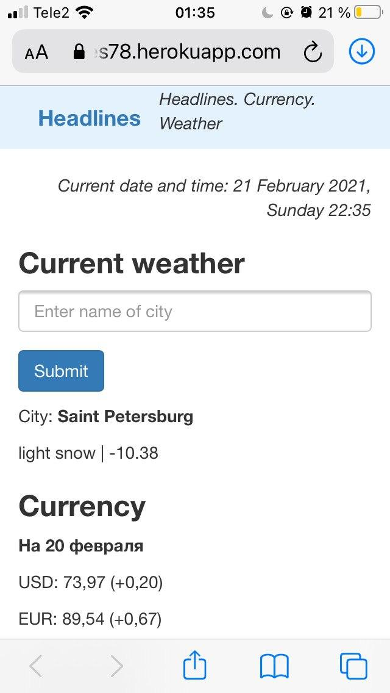
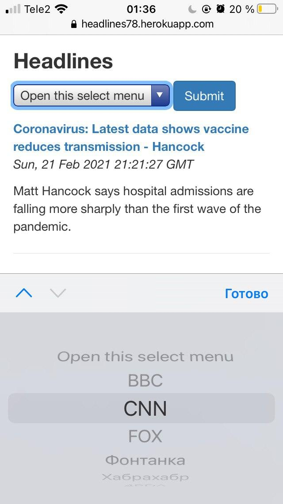

# headlines

**About:** The Headlines application by Flask

**Description:** The Headlines application displays up-to-date news headlines, weather information,
and currency exchange rates to users

  

<b>The main page</b>

  

<b>The choice headlines</b>

